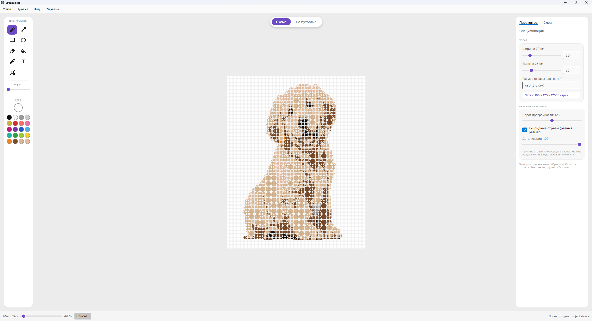
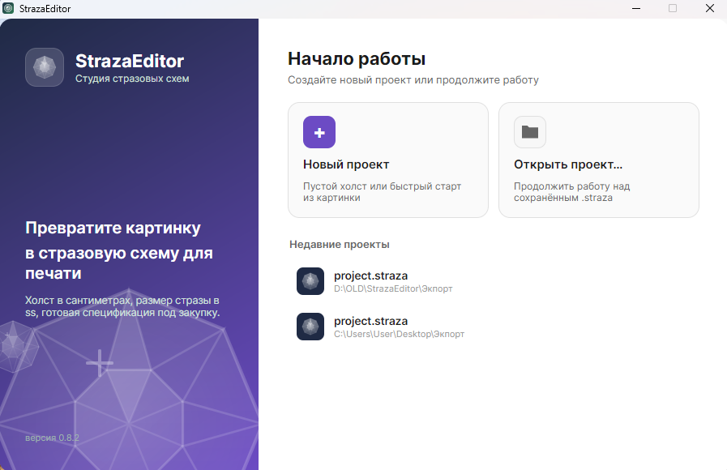

# 💎 StrazaEditor — Студия для создания стразовых схем и трафаретов

**StrazaEditor** — это десктопное приложение для мастеров рукоделия, дизайнеров одежды и студий кастомизации. Программа позволяет за один клик превратить любое изображение в детализированную схему для выкладки стразами или алмазной мозаики с последующим экспортом под печать трафарета.

<!-- Сюда вставляем главный скриншот программы с собакой -->

---

## 🔥 Ключевые возможности

* **Быстрый старт из любой картинки:** Автоматический перевод фотографии или арта в стразовую сетку без долгих ручных настроек.
* **Реальные физические размеры:** Настройка рабочего холста в сантиметрах и поддержка стандартных размеров страз в системе **SS** (например, ss6 / 2.0 мм, ss12 / 3.0 мм и др.).
* **Умный расчет спецификации:** Программа автоматически считает точное количество страз каждого цвета и размера. Вы точно знаете, сколько расходников нужно закупить еще до начала работы!
* **Гибридные стразы:** Возможность использовать крупные стразы на однородных зонах и мелкие на деталях для сохранения четкости рисунка.
* **Гибкая обработка фона:** Настройка порога прозрачности для легкого удаления фона изображения прямо в процессе создания схемы.
* **Готовность к печати:** Удобный экспорт готового проекта и разметки для создания физических трафаретов.

---

## 🚀 Установка и запуск

1. Перейдите в раздел [Releases](../../releases) этого репозитория.
2. Скачайте последнюю версию архива или установщика (`StrazaEditor_v0.9.0.exe`).
3. Запустите приложение и создайте свой первый проект!

<!-- Сюда вставляем скриншот экрана приветствия -->

---

## 💡 Статус проекта и планы развития

Сейчас проект находится на стадии активной разработки и сбора обратной связи, поэтому приложение доступно **абсолютно бесплатно** для всех желающих! Никаких регистраций, привязок карт и ограничений по времени.

В будущем, когда весь запланированный функционал будет реализован, мы планируем перейти на честную модель монетизации без надоевших подписок (разовая покупка программы навсегда + опциональное продление периодов поддержки и обновлений). А пока — пользуйтесь, тестируйте и делитесь впечатлениями!

---

## 💬 Обратная связь

Мне очень важен фидбек от реальных мастеров и пользователей! Если вы нашли ошибку, хотите предложить новую функцию или просто поделиться впечатлениями от работы в программе:

* Создайте тему в разделе [Issues](../../issues).
* Опишите вашу идею или проблему, и она обязательно будет учтена в следующих обновлениях.

---
*© 2026 StrazaEditor. Все права защищены.*
